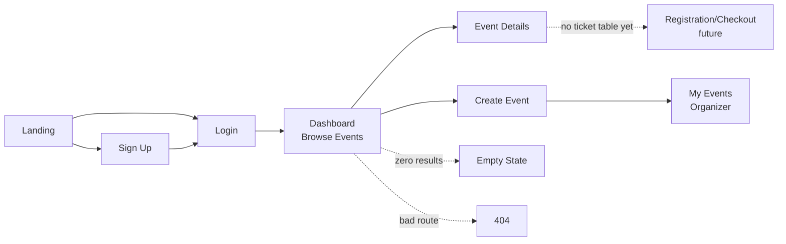

# Handsome Frank — Style Reference (Ticketing App Edition)
> Curator's atelier with living murals — a warm-paper gallery where illustrated worlds bloom against indigo frames.

**Theme:** light
**Scope:** This reference now covers the full ticketing application, not just the landing page — Sign Up, Login, Dashboard (browse events), Event Details, Create Event, My Events, and shared utility states (empty/404). Tokens, components, and the do's/don'ts below are shared across every page; the new "Application Pages" section maps them onto each screen in chronological product-flow order. Stack: **Go (net/http) + htmx + Tailwind**, server-rendered templates with htmx partial swaps rather than a client-side SPA.

Handsome Frank operates as a curator's atelier for contemporary illustration: full-bleed illustrated hero scenes give way to warm paper-toned canvases where artist work is presented with museum-label restraint. The system is defined by a single dominant deep indigo (#160572) that anchors navigation, headlines, and the closing footer bar, surrounded by hairline black borders that act like gallery frame edges. Typography is a two-voice conversation — a tight-tracked editorial serif (Millik) for hero/display headlines and a quiet grotesque (Klarheit) for everything structural. Color is deployed as curated punctuation: the hero illustration carries the chromatic spectrum, while the rest of the page stays achromatic with isolated bursts of vivid red, teal, orange, and yellow acting as spotlight accents on links, tags, and project cards. Away from the landing hero, interior pages (auth, dashboard, forms) lean almost entirely on the achromatic cream/white/hairline system — chromatic color is reserved for CTAs, status, and badges, exactly as the "Do's and Don'ts" section prescribes.

## Tokens — Colors

| Name | Value | Token | Role |
|------|-------|-------|------|
| Indigo Frame | `#160572` | `--color-indigo-frame` | Navigation strokes, display headlines, footer band — the deepest anchor in the system, commanding authority without shouting |
| Cream Paper | `#f2ebe6` | `--color-cream-paper` | Primary page canvas for content sections — warm eggshell that softens black text and lets illustration breathe |
| Pure White | `#ffffff` | `--color-pure-white` | Card surfaces, reversed text on dark bands, and the clean counterpoint to cream — the gallery wall |
| Obsidian Hairline | `#000000` | `--color-obsidian-hairline` | Dominant border, text, and icon stroke — used as a 1-2px frame line across nav, cards, and decorative elements |
| Slate Ink | `#2c2c2c` | `--color-slate-ink` | Secondary text and softer borders where pure black feels too severe |
| Fog Wash | `#eef4fb` | `--color-fog-wash` | Pale blue-tinted background for muted emphasis blocks |
| Buttermilk | `#fef9ee` | `--color-buttermilk` | Subtle warm wash for highlighted text or callout backgrounds |
| Crimson Spotlight | `#ea0706` | `--color-crimson-spotlight` | Editorial accent for critical announcements and bold display statements — the marquee marker |
| Vermillion | `#d64e2e` | `--color-vermillion` | Warm secondary accent on project card titles, links, and illustrative borders |
| Apricot Whisper | `#e29675` | `--color-apricot-whisper` | Soft warm accent for icon strokes and decorative borders |
| Peach Blush | `#eea883` | `--color-peach-blush` | Mid-warmth accent on icon outlines and link underlines |
| Tangerine Pop | `#ff7701` | `--color-tangerine-pop` | Filled action button background — the only true filled CTA, used for the play/forward action in the footer |
| Cobalt Stage | `#2544a0` | `--color-cobalt-stage` | Filled action button background for primary browse/enter actions |
| Plum Velvet | `#4b0f4d` | `--color-plum-velvet` | Filled action button background for dark editorial CTAs |
| Rose Petal | `#d98199` | `--color-rose-petal` | Filled action button background for soft secondary entries |
| Electric Teal | `#24e3dc` | `--color-electric-teal` | Interactive link and menu accent — the only cool chromatic in the system, reserved for navigation affordances |
| Acid Green | `#24e34c` | `--color-acid-green` | Secondary interactive link accent for hover/active states |
| Daffodil | `#f9e44d` | `--color-daffodil` | Decorative icon and link accent — cheerful punctuation |
| Highlighter Yellow | `#ffff00` | `--color-highlighter-yellow` | Badge background for editorial tags and callout labels |

## Tokens — Typography

### Arial — Arial — detected in extracted data but not described by AI · `--font-arial`
- **Weights:** 400, 700
- **Sizes:** 13px
- **Line height:** 1.2
- **Role:** Arial — detected in extracted data but not described by AI

### Millik — Display serif for hero headlines, artist names, and editorial display copy. The extreme negative letter-spacing (-0.05em at 88px down to -0.018em at 20px) and tight line-height (0.95–1.00 at large sizes) is the signature: the type sits dense and confident, not airy. Use weight 400 for editorial body, 700 for display headlines. · `--font-millik`
- **Substitute:** Fraunces, Playfair Display, or Recoleta
- **Weights:** 400, 700
- **Sizes:** 20, 22, 32, 38, 42, 54, 70, 80, 88
- **Line height:** 0.95–1.10 for display, 1.36 for body
- **Letter spacing:** -0.0500em, -0.0420em, -0.0230em, -0.0210em, -0.0180em, 0.0200em, 0.0380em
- **Role:** Display serif for hero headlines, artist names, and editorial display copy. The extreme negative letter-spacing (-0.05em at 88px down to -0.018em at 20px) and tight line-height (0.95–1.00 at large sizes) is the signature: the type sits dense and confident, not airy. Use weight 400 for editorial body, 700 for display headlines.

### Klarheit Grotesk — Workhorse grotesque for navigation, body text, buttons, badges, and supporting labels. Regular (400) is the default; Semibold (600) appears at 22px for subheadings; Bold (700) at 24px for nav emphasis. The grotesque is intentionally quiet — it holds the structure while the serif does the talking. · `--font-klarheit-grotesk`
- **Substitute:** Inter, Söhne, or Neue Haas Grotesk
- **Weights:** 400, 600, 700
- **Sizes:** 12, 14, 16, 22, 24
- **Line height:** 1.20–1.36
- **Role:** Workhorse grotesque for navigation, body text, buttons, badges, and supporting labels. Regular (400) is the default; Semibold (600) appears at 22px for subheadings; Bold (700) at 24px for nav emphasis. The grotesque is intentionally quiet — it holds the structure while the serif does the talking.

### Type Scale

| Role | Size | Line Height | Letter Spacing | Token |
|------|------|-------------|----------------|-------|
| caption | 12px | 1.2 | — | `--text-caption` |
| body-sm | 14px | 1.36 | — | `--text-body-sm` |
| body | 16px | 1.36 | — | `--text-body` |
| subheading | 22px | 1.28 | — | `--text-subheading` |
| heading | 32px | 1.1 | — | `--text-heading` |
| heading-lg | 54px | 1 | — | `--text-heading-lg` |
| display | 88px | 0.95 | — | `--text-display` |

## Tokens — Spacing & Shapes

**Density:** comfortable

### Spacing Scale

| Name | Value | Token |
|------|-------|-------|
| 10 | 10px | `--spacing-10` |
| 12 | 12px | `--spacing-12` |
| 15 | 15px | `--spacing-15` |
| 16 | 16px | `--spacing-16` |
| 18 | 18px | `--spacing-18` |
| 20 | 20px | `--spacing-20` |
| 24 | 24px | `--spacing-24` |
| 28 | 28px | `--spacing-28` |
| 32 | 32px | `--spacing-32` |
| 36 | 36px | `--spacing-36` |
| 38 | 38px | `--spacing-38` |
| 40 | 40px | `--spacing-40` |
| 60 | 60px | `--spacing-60` |
| 80 | 80px | `--spacing-80` |
| 86 | 86px | `--spacing-86` |
| 215 | 215px | `--spacing-215` |

### Border Radius

| Element | Value |
|---------|-------|
| nav | 0px |
| cards | 10px |
| buttons | 30px |
| projectCards | 0px |

### Layout

- **Page max-width:** 1200px
- **Section gap:** 64-80px
- **Card padding:** 20-24px
- **Element gap:** 20px

## Components

### Full-Bleed Illustrated Hero
**Role:** Opening visual statement

Edge-to-edge illustration covering 100% viewport width and height. No padding or margin. Text overlay is white, left-aligned, positioned at lower-third. Logo sits top-left in white script. Single teal circular hamburger menu top-right. The illustration IS the surface — no card, no frame, no overlay tint.

### Hero Display Headline
**Role:** Primary value statement

Millik 88px, weight 400, line-height 0.95, letter-spacing -4.4px, color #ffffff. Sits directly on the illustrated hero. One bold sentence + one supporting tagline (Millik 22px, weight 400, line-height 1.36). No drop shadow — the contrast against the dark foliage carries readability.

### Script Wordmark
**Role:** Brand identity

Custom calligraphic script reading 'Handsome Frank'. White on dark sections, indigo on light sections. Fixed top-left, ~24-32px height. Stays present across scroll.

### Circular Menu Trigger
**Role:** Primary navigation opener

Solid teal (#24e3dc) circle, ~48px diameter, three white horizontal lines (hamburger). Fixed top-right. No border, no shadow. The only persistent interactive chrome.

### Editorial Section Headline
**Role:** Section opener on cream canvas

Millik 32-42px, weight 400, line-height 1.00-1.10, color #160572. Centered, sits above a row of cards. Generous 40-60px margin-top, 30-40px margin-bottom. The indigo color is the thread connecting nav, headline, and footer.

### Artist Portfolio Card
**Role:** Artist thumbnail in browse grid

Square or near-square thumbnail of the artist's signature illustration. No border, no radius — the artwork's own edges define the card. Artist name below in Klarheit Grotesk 14px bold, centered. Background: cream paper. Gap between cards: 20-24px. 4-column grid on desktop.

### Featured Project Card
**Role:** Editorial project highlight

Full-bleed solid color card (#2544a0, #ff7701, #4b0f4d, #d98199 used as card backgrounds). Large circular image cutout (radius 50%) centered in the card. Project title in Klarheit Grotesk 22px bold, white, top-left aligned. 4-column grid. Cards have no radius — they are bold flat color blocks.

### Pill Button (Filled)
**Role:** Primary or secondary action

Border-radius 30px (full pill). Background: one of the filled chromatic colors (#2544a0, #ff7701, #4b0f4d, #d98199). Text: Klarheit Grotesk 14-16px bold, white. Padding: 12-16px vertical, 28-38px horizontal. No border, no shadow. The pill shape is the signature button form — used sparingly for browse/enter actions only.

### Outlined Link
**Role:** Inline editorial link

Klarheit Grotesk 14-16px, color matching the accent palette (teal, green, red, orange, yellow). Underlined with a 1-2px solid border in the same color, 2-4px offset from baseline. No background. The colored underline IS the link affordance — no button shape needed.

### Highlighter Badge
**Role:** Editorial tag or label

Background #ffff00 (highlighter yellow). Text: Klarheit Grotesk 12px bold, #000000. No border, no radius. Padding: 4-6px vertical, 8-10px horizontal. Mimics a physical highlighter pen mark on a page.

### Announcement Banner
**Role:** Breaking news or signing announcement

Sits above the footer. Cream or white background. Headline in Millik 54px weight 700, color #ea0706 (crimson). A small circular avatar thumbnail precedes the text. Follow CTA in Klarheit Grotesk 22px bold to the right. The red headline is the loudest single moment on an otherwise quiet page.

### Indigo Footer Band
**Role:** Closing call-to-action bar

Full-bleed #160572 background, ~100-120px tall. Centered content: a tangerine pill button with white play-icon glyph, followed by 'Browse Illustrators.' in Klarheit Grotesk 22px bold, white. The contrast between the orange button and indigo bar is the strongest color pairing in the system.

### Hairline Border Frame
**Role:** Structural divider and frame

1-2px solid #000000 border. Used on cards, nav elements, decorative containers, and section dividers. The black hairline is the connective tissue — it gives every element gallery-frame presence without weight.

### Contained Page Header
**Role:** Interior-page nav for every non-hero screen

Replaces the full-bleed hero chrome on Sign Up, Login, Dashboard, Event Details, Create Event, and My Events. Cream (#f2ebe6) background, 1px #000000 bottom hairline (no shadow). Indigo script wordmark top-left, 24px height. On authenticated pages, a right-aligned Klarheit Grotesk 14px bold nav cluster (Browse · Create Event · My Events · Avatar) replaces the circular hamburger. Height 72-80px, contained to `--page-max-width`.

### Auth Card
**Role:** Container for Sign Up and Login forms

Pure white surface, 1-2px solid #000000 hairline border, `--radius-cards` (10px), 32-40px padding, max-width 420px, centered on a cream canvas. Millik 32px headline at top (e.g. "Create your account"), Klarheit Grotesk 14px slate-ink subtext below it. No drop shadow — separation from the cream canvas comes from the hairline + white fill, consistent with the system's flat-elevation rule.

### Form Field (Text / Email / Password)
**Role:** Data entry for auth and event-creation forms

Label: Klarheit Grotesk 12px bold, uppercase, #2c2c2c, 6-8px margin-bottom (matches caption scale). Input: white fill, 1px solid #000000 border, `--radius-lg` (10px) — deliberately NOT the 30px pill radius, which is reserved for buttons only, so fields read as "content" not "action." Padding 12px 16px, Klarheit Grotesk 16px body text. Focus state: border becomes 2px `--color-cobalt-stage` (#2544a0), no glow/shadow (flat-elevation rule holds). Error state: border becomes 2px `--color-crimson-spotlight` (#ea0706); helper text below in Klarheit Grotesk 12px, same crimson, prefixed with a small line icon rather than an emoji.

### Full-Width Form Button
**Role:** Primary submit action inside an Auth Card or form

Same pill construction as the marketing Pill Button (30px radius, no border/shadow) but stretched to `width: 100%` inside its card. Default fill `--color-cobalt-stage` for "create/confirm" actions (sign up, login, create event) and `--color-tangerine-pop` for a secondary "browse/enter" affordance, keeping the existing color-to-intent mapping from the landing page rather than inventing new button colors.

### Event Card (Dashboard Grid)
**Role:** Event thumbnail in the Dashboard browse grid

Direct sibling of the Artist Portfolio Card pattern, adapted for event data instead of artwork. Square-ish illustrated or photographic placeholder top (16:10), no border/radius on the image — artwork fills edge-to-edge as usual. Below the image: event name in Klarheit Grotesk 16px bold #000000, one line, truncated; date + location in Klarheit Grotesk 14px #2c2c2c; a Highlighter Badge (or Outlined Link color) showing ticket status ("12 left", "Sold out" in crimson). Card itself has no border/radius (project-card rule) — only the pill "View Event" button revealed on hover carries the 30px radius.

### Status Badge
**Role:** Ticket availability / event state indicator

Reuses the Highlighter Badge shape (no radius, no border, bold 12px Klarheit Grotesk, tight padding) but recolors by state: `--color-highlighter-yellow` bg/black text for "Few tickets left," `--color-acid-green` bg/black text for "Tickets available," `--color-crimson-spotlight` bg/white text for "Sold out." Same physical "highlighter mark" metaphor, just semantically extended from editorial tags to inventory state.

### Inline Toast / htmx Swap Notice
**Role:** Feedback after an htmx form submission (success or error), swapped into an `hx-target` region without a full page reload

Full-width band, `--radius-lg` corners, 1px hairline border in the semantic color (crimson for error, cobalt for success), 16px padding, Klarheit Grotesk 14px. Sits directly above the form it responds to. This is the one place a "filled tint" background is allowed off the marketing page: use `--color-buttermilk` wash for success and an 8% crimson tint for error, keeping text at full-strength black/crimson for contrast. Because htmx swaps this region in place, it must not shift layout height abruptly — reserve the space or animate height via a short CSS transition.

### Stepper / Progress Rail
**Role:** Orientation inside the multi-section Create Event form

Horizontal row of 3 Klarheit Grotesk 12px bold labels ("Details → Tickets → Review") connected by a 1px #000000 hairline. Active step: label in `--color-indigo-frame`, dot filled indigo. Completed step: dot filled `--color-acid-green`. Upcoming step: dot outlined only, label in `--color-slate-ink`. This is a navigation aid, not a hard wizard — htmx can still swap sections independently, so the rail reflects state rather than gating it.

### Empty State
**Role:** Zero-data condition (no events yet, no results for a search/filter)

Centered within the content area, cream canvas. A single-color line illustration (reuse the black hairline/icon language, not a stock graphic) roughly 120-160px, Millik 22px headline beneath it ("No events yet."), Klarheit Grotesk 14px slate-ink supporting line, and — where actionable — a single Pill Button in `--color-tangerine-pop` ("Create your first event"). No border/card around the empty state itself; it sits directly on the canvas.

## Do's and Don'ts

### Do
- Use Millik serif for all display headlines and editorial titles; let it carry the personality with negative letter-spacing and tight line-height (0.95-1.10)
- Reserve #160572 indigo for navigation strokes, editorial headlines, and the closing footer band — it is the thread that stitches the page together
- Use the full pill shape (30px radius) for all filled action buttons, and pick from the four chromatic button backgrounds (#2544a0, #ff7701, #4b0f4d, #d98199) by context
- Apply 1-2px solid #000000 hairlines as decorative frames around cards, nav elements, and illustration containers — the gallery-frame motif
- Let illustrated or photographic content fill its container edge-to-edge with no border or radius — the artwork defines its own boundary
- Use #ffff00 as a flat badge/tag background with black text for editorial callouts — treat it like a highlighter pen mark
- Keep body text at 16px Klarheit Grotesk Regular with line-height 1.36 on the cream (#f2ebe6) canvas — the warmth softens the otherwise stark black/white system

### Don't
- Don't use neutral grays for primary buttons — the system has no gray CTA; buttons are always chromatic and pill-shaped
- Don't apply border-radius to project cards, illustration thumbnails, or content cards — only pill buttons get curves (30px), everything else stays sharp-edged
- Don't use the chromatic accent colors (teal, green, red, yellow, orange) for body text or large text blocks — they are reserved for links, icons, badges, and decorative strokes only
- Don't drop shadows on cards or images — the design uses hairline borders and flat color blocks for separation, never elevation
- Don't set body text below 14px or use letter-spacing looser than normal on small sizes — the system relies on compact, confident type
- Don't use gradient backgrounds or colored overlays on imagery — illustrations and photos display raw, edge-to-edge, on their own colors
- Don't center-align body paragraphs or nav items — the layout is left-aligned for text blocks and centered only for display headlines and footer CTAs

## Surfaces

| Level | Name | Value | Purpose |
|-------|------|-------|---------|
| 1 | Cream Paper | `#f2ebe6` | Primary content canvas |
| 2 | Pure White | `#ffffff` | Card and project tile surfaces |
| 3 | Indigo Band | `#160572` | Footer/closing bar |
| 4 | Obsidian | `#000000` | Full-bleed hero illustration base |

## Elevation

The system has no elevation. Separation between elements is achieved through hairline 1-2px solid #000000 borders, flat color blocking, and generous whitespace — never through drop shadows, blurs, or stacked surfaces. Cards sit on the same plane as the page; depth is implied by the gallery-frame border, not by shadow.

## Imagery

The site is defined by full-bleed, edge-to-edge illustration as its primary visual language. The hero is a rich, densely composed tropical jungle scene with vibrant birds in red, blue, teal, orange, and yellow against layered dark green foliage — a maximalist botanical mural. Subsequent sections showcase artist work as flat, full-color square or circular thumbnails with no borders or treatments applied; the artwork is always raw and unframed. Photography does not appear — every image is hand-illustrated. Iconography is minimal (hamburger lines, play triangle, social glyphs), all in white or black line. The illustration carries the chromatic spectrum; the UI chrome stays achromatic except for the indigo structural color.

## Layout

The page is a vertical scroll of full-bleed and max-width-contained sections alternating. The hero is 100% viewport, illustration-only with overlaid white type at lower-left. Content sections are max-width ~1200px centered on a cream (#f2ebe6) canvas, with generous vertical breathing room (64-80px section gaps). The artist grid is a 4-column row of square thumbnails with 20-24px gaps. The featured project section uses a 4-column grid of full-bleed solid-color cards with centered circular image cutouts. The announcement banner spans full-width with centered or split content. The closing footer is a full-bleed indigo band, ~100-120px tall, with centered pill button + label. Navigation is minimal: a fixed script wordmark top-left and a circular teal hamburger top-right — no nav bar, no breadcrumbs. The rhythm is: immersive hero → quiet cream gallery → bold color wall → quiet announcement → bold indigo close.

*(The layout above describes the Landing page specifically. Interior pages — auth, dashboard, event, and form screens — follow a different, more conventional contained layout, described in "Application Pages" below.)*

## Application Pages

The landing page is the only full-bleed, illustration-driven screen in the app. Every page after it is a **contained, max-width-1200px layout on the cream canvas**, using the `Contained Page Header` instead of hero chrome, because auth and utility flows need predictability, not spectacle — the hairline/cream/indigo system already reads as "considered" without needing a jungle mural behind a password field.

### User Journey (Chronological)



The dotted paths (checkout, empty state, 404) are utility branches rather than the main spine — noted so the flow stays honest about what the current schema (`users`, `events`) actually supports versus what's aspirational.

---

### 1. Sign Up
**Route:** maps to `POST /createUser` · **Auth required:** no

**Purpose:** First-run account creation. Entry point for anyone who lands on the marketing page and clicks a primary CTA.

**Layout:** `Contained Page Header` (logged-out nav: Login link only, top-right) → centered `Auth Card` on cream canvas, vertically centered with generous top margin (`--spacing-80`) → footer omitted or reduced to a single hairline-separated line, not the full indigo band (that's a closing/marketing device, not an interior-page one).

**Fields (from the `dto` the backend decodes):** Username, Email Address, Password — three `Form Field` components stacked with `--spacing-20` gaps.

**Primary action:** `Full-Width Form Button`, `--color-cobalt-stage` fill, label "Create account."

**Secondary:** Klarheit Grotesk 14px `Outlined Link` below the card — "Already have an account? Log in."

**htmx behavior:** `hx-post="/createUser"`, `hx-target="#auth-feedback"`, `hx-swap="outerHTML"`. The `Inline Toast` region sits above the form fields inside the card so success/error doesn't shift the card's position. On success, redirect via `HX-Redirect` response header to `/login` rather than swapping content — a full navigation is the right mental model for "you now have a different identity," even inside an htmx app.

---

### 2. Login
**Route:** maps to `POST /login` · **Auth required:** no

**Purpose:** Returning-user entry; sets the `access` httpOnly cookie the backend already issues.

**Layout:** Identical shell to Sign Up (`Auth Card`, same width/position) for visual continuity between the two — a user bouncing between them via the secondary link shouldn't feel a layout jump. Millik 32px headline: "Welcome back."

**Fields:** Email Address, Password — two `Form Field` components.

**Primary action:** `Full-Width Form Button`, same cobalt fill, label "Log in."

**Secondary:** "New here? Create an account." linking to Sign Up. (No "forgot password" flow exists in the current schema/handlers — flag this as a known gap rather than designing a page the backend can't serve yet.)

**htmx behavior:** `hx-post="/login"`, `hx-target="#auth-feedback"`. Since the backend already sets the cookie via `Set-Cookie` on the response and does not currently issue a server-side redirect, the front end should still use `HX-Redirect` to `/dashboard` on success so the login card doesn't just silently swap in a token — the user needs a clear "you're in" transition.

---

### 3. Dashboard (Browse Events)
**Route:** maps to `GET /dashboard` (currently authenticated-only; consider whether browsing should be public and only *purchasing* gated) · **Auth required:** yes, per current `RequireAuthentication` middleware

**Purpose:** The hub. First screen after login; where a user finds an event to view or jumps into creating their own.

**Layout:** `Contained Page Header` with full authenticated nav cluster. Below it, an `Editorial Section Headline` ("Upcoming Events") and an optional filter/search row (plain `Form Field` styled as a search input, `Outlined Link`-style category filters — no new component needed). Then a **4-column `Event Card` grid**, 20-24px gaps, matching the Artist Portfolio Card rhythm from the landing page so the visual language carries over. If zero events: swap the grid for the `Empty State` component.

**htmx behavior:** Filter/search inputs use `hx-get="/dashboard"` with `hx-trigger="input changed delay:300ms"` and `hx-target="#event-grid"` so filtering re-renders only the grid partial, not the header — this is the pattern to reach for anywhere a search box should feel instant without a full reload.

---

### 4. Event Details
**Route:** would need a new `GET /events/{id}` handler (not yet present — `GetEvent` in `eventHandler.go` is currently an empty stub) · **Auth required:** view = no, register/buy = yes (once that flow exists)

**Purpose:** Single-event deep dive; the page that actually has to sell the event.

**Layout:** `Contained Page Header` → full-width illustrated/photo banner (16:6, no border/radius — the one place inside an interior page allowed to borrow the hero's "raw edge-to-edge image" rule) → below it, a two-column contained section: left column (roughly 65%) carries the Millik 42px event title, Klarheit Grotesk 16px description, and a hairline-bordered info strip (date, time, location, capacity) using small caption-style labels; right column (roughly 35%) is a white `Auth-Card`-style panel — hairline border, 10px radius — showing ticket type, price, `Status Badge`, and quantity selector, sticky-positioned on scroll.

**Primary action:** `Pill Button`, `--color-tangerine-pop` fill, "Get Tickets" — wired to whatever registration/checkout endpoint gets built on top of the current `events` table (it has no `ticket` or `order` table yet, so this button is currently a placeholder target for future work, not a dead end to hide).

**htmx behavior:** Quantity selector uses `hx-get` to re-fetch and swap just the price subtotal region as the user adjusts count — small, contained partial, not a full-page interaction.

---

### 5. Create Event
**Route:** maps to `POST /events` · **Auth required:** yes (should be — currently not gated by `RequireAuthentication` in `routers.go`, worth flagging as a gap since anyone could currently hit this endpoint)

**Purpose:** Organizer flow — turns a person from attendee into event creator.

**Layout:** `Contained Page Header` → `Stepper / Progress Rail` (Details → Tickets → Review) → a single wide `Auth-Card`-style container (white, hairline, 10px radius, but full content-width ~720px instead of the narrow 420px auth width, since this form carries more fields).

**Fields (from `model.Event`):** Event Name, Location, Start Time (date+time picker styled as a `Form Field`), Total Capacity, Available Tickets, Ticket Types — grouped into the "Details" and "Tickets" stepper sections respectively.

**Primary action:** `Full-Width Form Button` (or right-aligned pill, since this form is wider than the narrow auth cards), cobalt fill, "Publish Event." A secondary ghost/outlined "Save Draft" is a reasonable addition even though the backend doesn't currently persist draft state — worth calling out as a future schema addition (a `status` column on `events`) rather than silently designing around it.

**htmx behavior:** Each stepper section is its own `hx-post`-able partial (`hx-target="#create-event-form"`, `hx-swap="innerHTML"`) so a validation error on "Tickets" doesn't blow away what was already typed in "Details" — this is the core reason to reach for htmx over a plain form post here: partial revalidation without client-side state management.

---

### 6. My Events (Organizer)
**Route:** not yet implemented — would need `GET /users/{id}/events` or similar filtered query · **Auth required:** yes

**Purpose:** "Necessary" page implied by Create Event existing at all — an organizer needs somewhere to see and manage what they've published. Without it, Create Event is a one-way door.

**Layout:** Same `Contained Page Header` + `Event Card` grid pattern as the Dashboard, but scoped to the logged-in user's events, with an `Editorial Section Headline` reading "Your Events" and a `Pill Button` ("+ New Event") pinned top-right of the section instead of buried in nav. Empty state reuses the `Empty State` component verbatim.

---

### Utility States

**Empty State** — used on Dashboard (no events match filter) and My Events (organizer has created nothing yet). See component spec above.

**404 / Not Found** — `Contained Page Header` (logged-out or logged-in, whichever applies) → centered Millik 54px "404" in `--color-indigo-frame`, Klarheit Grotesk 16px supporting line, single `Pill Button` back to Dashboard or Landing depending on auth state. Deliberately minimal — no illustration, so it doesn't compete with the hero's visual weight elsewhere in the app.

## Agent Prompt Guide

## Quick Color Reference
- Text: #000000 (primary), #2c2c2c (secondary), #160572 (headlines/brand)
- Background: #f2ebe6 (cream canvas), #ffffff (cards), #160572 (footer band)
- Border: #000000 hairline 1-2px (structural frames)
- Accent: #24e3dc (teal, interactive), #ea0706 (crimson, editorial)
- primary action: #ff7701 (filled action)

## Example Component Prompts

1. **Full-Bleed Illustrated Hero**: Full-viewport (100vw × 100vh) illustrated background with no padding, no border, no overlay. White script wordmark 'Handsome Frank' fixed top-left at 28px height. Teal (#24e3dc) circular hamburger button 48px diameter fixed top-right with three white lines. White display headline at 88px Millik weight 400, line-height 0.95, letter-spacing -4.4px, positioned at 40% from top, left-aligned with 80px left margin. Supporting tagline at 22px Millik weight 400, line-height 1.36, white, directly below.

2. **Artist Portfolio Card Grid**: 4-column grid on cream (#f2ebe6) background, 20px gap. Each card is a square (1:1) illustration thumbnail with no border, no radius — artwork fills the container. Artist name below in Klarheit Grotesk 14px weight 700, color #000000, centered, 12px margin-top from card.

3. **Featured Project Card**: Full-bleed solid color block (choose from #2544a0, #ff7701, #4b0f4d, #d98199), no border, no radius. 200px circular image cutout (border-radius 50%) centered horizontally, positioned 40% from top. Project title in Klarheit Grotesk 22px weight 700, white, top-left aligned with 24px padding.

4. **Outlined Link**: Klarheit Grotesk 16px weight 400, color #24e3dc (teal) or other accent. Underline is a 2px solid border-bottom in the same color, offset 4px from text baseline. No background, no button shape, no padding.

5. **Indigo Footer Band**: Full-bleed #160572 background, 120px tall, centered content. Tangerine (#ff7701) pill button 48px tall, 30px border-radius, white play triangle glyph. Button label 'Browse Illustrators.' in Klarheit Grotesk 22px weight 700, white, 16px to the right of the button.

## Gallery-Frame Motif

The 1-2px solid black hairline border is not just a separator — it is the design's signature gesture. Every card, every nav element, every decorative container is treated as an object hung on a gallery wall. The border gives each element presence and weight without using shadow or fill. When in doubt about how to separate two elements, add a 1px #000000 border rather than increasing whitespace, changing background color, or adding elevation. This is the system's way of saying: this is curated, this is framed, this matters.

## Similar Brands

- **It's Nice That** — Same editorial-creative-agency energy: curated artist spotlights, full-bleed illustration heroes, serif display headlines, and a quiet achromatic page that lets the work speak
- **WeTransfer / Paper by FiftyThree** — Same confident use of full-bleed illustration as primary content, large editorial serif type, and a cream/warm-paper canvas for secondary sections
- **Studio Brasch** — Same flat-color-block project cards with circular image cutouts, bold chromatic backgrounds behind featured work, and a dark closing band
- **Apt Studio** — Same minimal navigation chrome (wordmark + circular menu), generous section breathing room, and a two-voice typography system pairing a display serif with a quiet grotesque

## Quick Start

### CSS Custom Properties

```css
:root {
  /* Colors */
  --color-indigo-frame: #160572;
  --color-cream-paper: #f2ebe6;
  --color-pure-white: #ffffff;
  --color-obsidian-hairline: #000000;
  --color-slate-ink: #2c2c2c;
  --color-fog-wash: #eef4fb;
  --color-buttermilk: #fef9ee;
  --color-crimson-spotlight: #ea0706;
  --color-vermillion: #d64e2e;
  --color-apricot-whisper: #e29675;
  --color-peach-blush: #eea883;
  --color-tangerine-pop: #ff7701;
  --color-cobalt-stage: #2544a0;
  --color-plum-velvet: #4b0f4d;
  --color-rose-petal: #d98199;
  --color-electric-teal: #24e3dc;
  --color-acid-green: #24e34c;
  --color-daffodil: #f9e44d;
  --color-highlighter-yellow: #ffff00;

  /* Typography — Font Families */
  --font-arial: 'Arial', ui-sans-serif, system-ui, -apple-system, BlinkMacSystemFont, "Segoe UI", Roboto, sans-serif;
  --font-millik: 'Millik', ui-sans-serif, system-ui, -apple-system, BlinkMacSystemFont, "Segoe UI", Roboto, sans-serif;
  --font-klarheit-grotesk: 'Klarheit Grotesk', ui-sans-serif, system-ui, -apple-system, BlinkMacSystemFont, "Segoe UI", Roboto, sans-serif;

  /* Typography — Scale */
  --text-caption: 12px;
  --leading-caption: 1.2;
  --text-body-sm: 14px;
  --leading-body-sm: 1.36;
  --text-body: 16px;
  --leading-body: 1.36;
  --text-subheading: 22px;
  --leading-subheading: 1.28;
  --text-heading: 32px;
  --leading-heading: 1.1;
  --text-heading-lg: 54px;
  --leading-heading-lg: 1;
  --text-display: 88px;
  --leading-display: 0.95;

  /* Typography — Weights */
  --font-weight-regular: 400;
  --font-weight-semibold: 600;
  --font-weight-bold: 700;

  /* Spacing */
  --spacing-10: 10px;
  --spacing-12: 12px;
  --spacing-15: 15px;
  --spacing-16: 16px;
  --spacing-18: 18px;
  --spacing-20: 20px;
  --spacing-24: 24px;
  --spacing-28: 28px;
  --spacing-32: 32px;
  --spacing-36: 36px;
  --spacing-38: 38px;
  --spacing-40: 40px;
  --spacing-60: 60px;
  --spacing-80: 80px;
  --spacing-86: 86px;
  --spacing-215: 215px;

  /* Layout */
  --page-max-width: 1200px;
  --section-gap: 64-80px;
  --card-padding: 20-24px;
  --element-gap: 20px;

  /* Border Radius */
  --radius-lg: 10px;
  --radius-3xl: 30px;

  /* Named Radii */
  --radius-nav: 0px;
  --radius-cards: 10px;
  --radius-buttons: 30px;
  --radius-projectcards: 0px;

  /* Surfaces */
  --surface-cream-paper: #f2ebe6;
  --surface-pure-white: #ffffff;
  --surface-indigo-band: #160572;
  --surface-obsidian: #000000;
}
```

### Tailwind v4

```css
@theme {
  /* Colors */
  --color-indigo-frame: #160572;
  --color-cream-paper: #f2ebe6;
  --color-pure-white: #ffffff;
  --color-obsidian-hairline: #000000;
  --color-slate-ink: #2c2c2c;
  --color-fog-wash: #eef4fb;
  --color-buttermilk: #fef9ee;
  --color-crimson-spotlight: #ea0706;
  --color-vermillion: #d64e2e;
  --color-apricot-whisper: #e29675;
  --color-peach-blush: #eea883;
  --color-tangerine-pop: #ff7701;
  --color-cobalt-stage: #2544a0;
  --color-plum-velvet: #4b0f4d;
  --color-rose-petal: #d98199;
  --color-electric-teal: #24e3dc;
  --color-acid-green: #24e34c;
  --color-daffodil: #f9e44d;
  --color-highlighter-yellow: #ffff00;

  /* Typography */
  --font-arial: 'Arial', ui-sans-serif, system-ui, -apple-system, BlinkMacSystemFont, "Segoe UI", Roboto, sans-serif;
  --font-millik: 'Millik', ui-sans-serif, system-ui, -apple-system, BlinkMacSystemFont, "Segoe UI", Roboto, sans-serif;
  --font-klarheit-grotesk: 'Klarheit Grotesk', ui-sans-serif, system-ui, -apple-system, BlinkMacSystemFont, "Segoe UI", Roboto, sans-serif;

  /* Typography — Scale */
  --text-caption: 12px;
  --leading-caption: 1.2;
  --text-body-sm: 14px;
  --leading-body-sm: 1.36;
  --text-body: 16px;
  --leading-body: 1.36;
  --text-subheading: 22px;
  --leading-subheading: 1.28;
  --text-heading: 32px;
  --leading-heading: 1.1;
  --text-heading-lg: 54px;
  --leading-heading-lg: 1;
  --text-display: 88px;
  --leading-display: 0.95;

  /* Spacing */
  --spacing-10: 10px;
  --spacing-12: 12px;
  --spacing-15: 15px;
  --spacing-16: 16px;
  --spacing-18: 18px;
  --spacing-20: 20px;
  --spacing-24: 24px;
  --spacing-28: 28px;
  --spacing-32: 32px;
  --spacing-36: 36px;
  --spacing-38: 38px;
  --spacing-40: 40px;
  --spacing-60: 60px;
  --spacing-80: 80px;
  --spacing-86: 86px;
  --spacing-215: 215px;

  /* Border Radius */
  --radius-lg: 10px;
  --radius-3xl: 30px;
}
```
